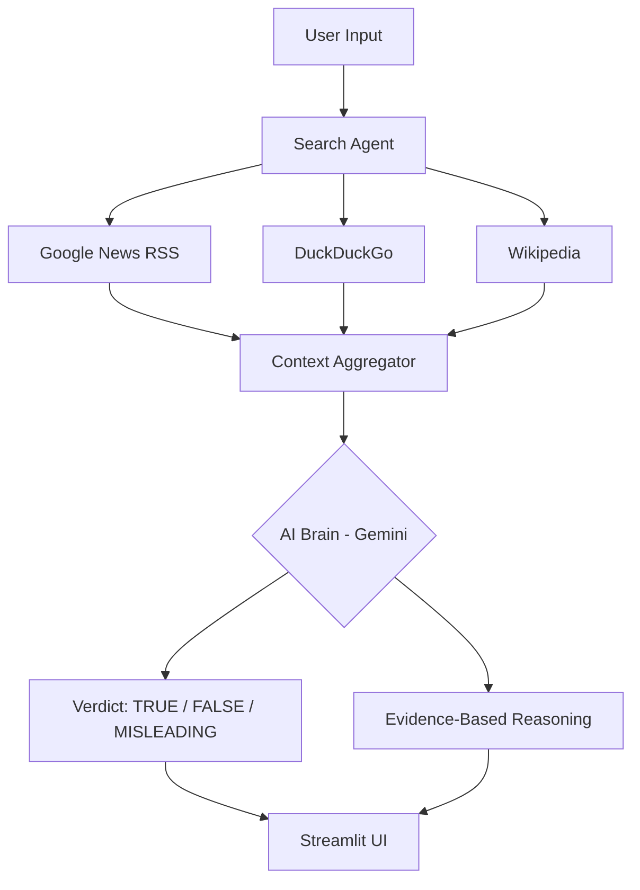
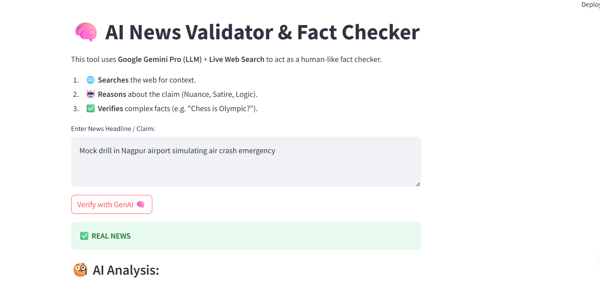
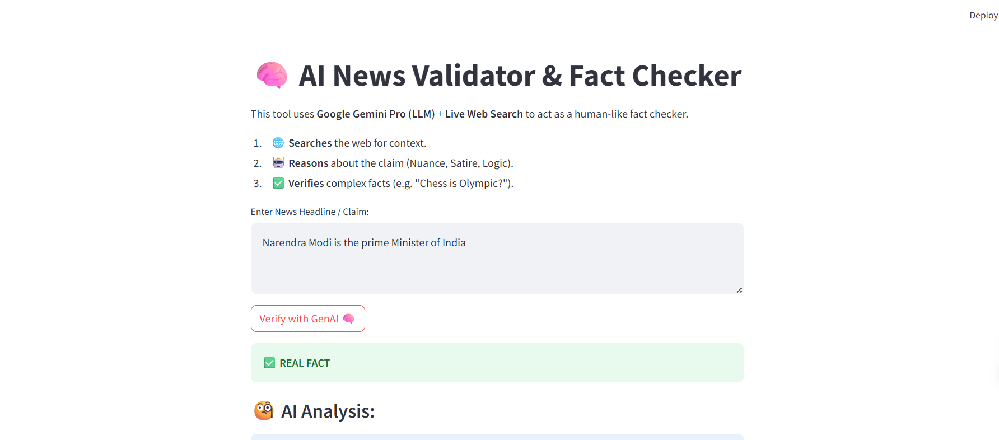

# 🧠 AI News Validator & Fact Checker

[](https://opensource.org/licenses/MIT)
[](https://www.python.org/downloads/)
[](https://streamlit.io/)

A state-of-the-art **Retrieval-Augmented Generation (RAG)** application designed to combat misinformation and AI hallucinations. This tool cross-references news claims against real-time web data using **Google Gemini 2.0 Flash** to provide verifiable, evidence-based verdicts.

---

## 🚀 Key Features

- **🌐 Live Web Retrieval:** Automatically searches Google News, DuckDuckGo, and Wikipedia for the most recent context.
- **🛡️ Hallucination Guard:** Implements 5 levels of pedagogical reasoning to ensure the AI doesn't "invent" data.
- **📍 Location & Entity Verification:** Specifically designed to catch mismatches in locations and dates (perfect for Indian news context).
- **🔄 Hybrid Logic Engine:** Uses Gemini 2.0 Pro for advanced reasoning with a robust keyword-based local fallback system.
- **🇮🇳 Indian Context Optimized:** Includes synthetic data generators trained on modern Indian socio-political event templates.

---

## 🛠️ Tech Stack

- **Large Language Model:** Google Gemini 2.0 Flash Lite
- **Frontend:** Streamlit
- **Search Engines:** Google News RSS, DuckDuckGo API, Wikipedia API
- **Machine Learning:** Scikit-Learn (TF-IDF + Logistic Regression), TensorFlow (Keras LSTM)
- **Data:** Pandas, NumPy, XML ElementTree

---

## 📐 Architecture (RAG Flow)



---

## ⚙️ Installation & Setup

### 1. Prerequisites
- Python 3.8 or higher
- A **Google Gemini API Key** (Free) - [Get it here](https://aistudio.google.com/)

### 2. Clone the Repository
```bash
git clone https://github.com/your-username/FakeNewsDetector.git
cd FakeNewsDetector
```

### 3. Install Dependencies
```bash
pip install -r requirements.txt
```

### 4. Configuration
Open `web_app.py` and replace the placeholder API key with your own:
```python
GOOGLE_API_KEY = "YOUR_GEMINI_API_KEY"
```

### 5. Run the Application
```bash
streamlit run web_app.py
```

---

## 📊 Training the local model (Optional)
If you want to use the local machine learning features:
1. Generate the dataset: `python generate_indian_dataset.py`
2. Train the model: `python train.py`

---

## 📸 Screenshots

| Real-Time News Verification | Factual Claim Verification |
| :---: | :---: |
|  |  |

---

## 📜 License

This project is licensed under the **MIT License** - see the [LICENSE](LICENSE) file for details.

---

## ✍️ Author & Credits

- **Developed by:** Disha Polamarasetti
- **Role:** Data Science Student | AI & ML Enthusiast
- **Objective**:Built as a capstone project to demonstrate RAG (Retrieval-Augmented Generation) and combat online misinformation.
- **Contact:**[GitHub](https://github.com/dpolamar-eng) | [LinkedIn Profile](https://www.linkedin.com/in/disha-pol)

---
## 📜 License

This project is licensed under the **MIT License** - see the [LICENSE](LICENSE) file for details.


Developed with ❤️ to stop the spread of fake news.
